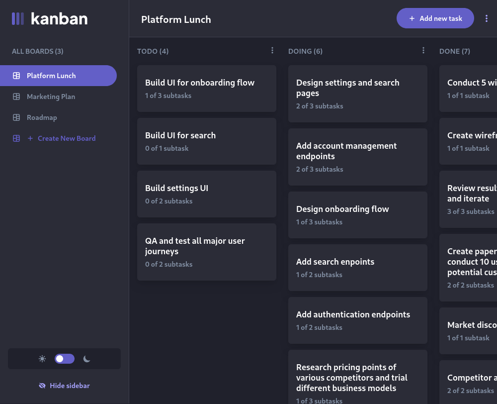

# Frontend Mentor - Kanban task management web app solution

This is a solution to the [Kanban task management web app challenge on Frontend Mentor](https://www.frontendmentor.io/challenges/kanban-task-management-web-app-wgQLt-HlbB). Frontend Mentor challenges help you improve your coding skills by building realistic projects.

## Table of contents

- [Built with](#built-with)

### Built with

- [Next.js](https://nextjs.org/)
- [React.js](https://react.dev)
- [Tailwindcss](https://tailwindcss.com/)
- [next-themes](https://www.npmjs.com/package/next-themes)
- [react icons](https://react-icons.github.io/react-icons/)
- [framer motion](https://www.framer.com/motion/)
- [mongodb](https://www.npmjs.com/package/mongodb)
- [bcryptjs](https://www.npmjs.com/package/bcryptjs)
- [react-hook-form](https://react-hook-form.com/)
- [next-auth.js](https://next-auth.js.org/)
